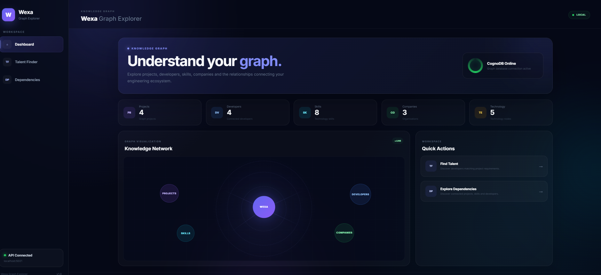
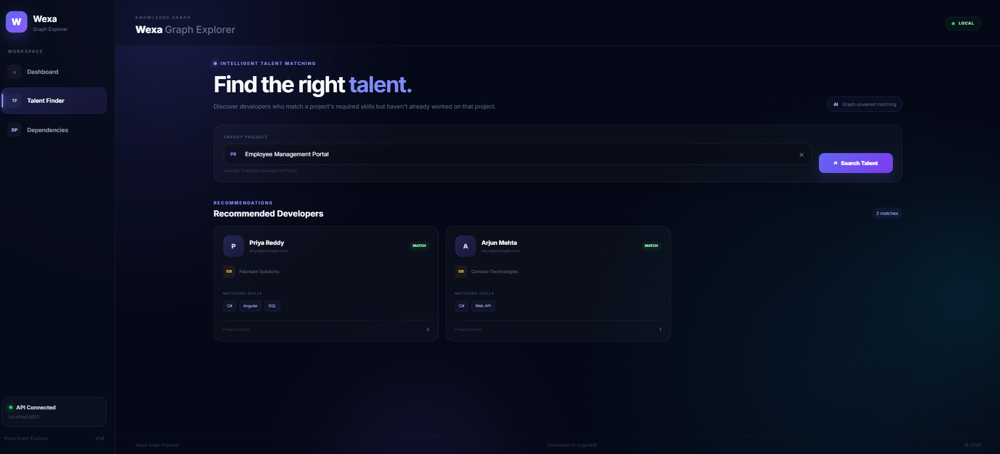
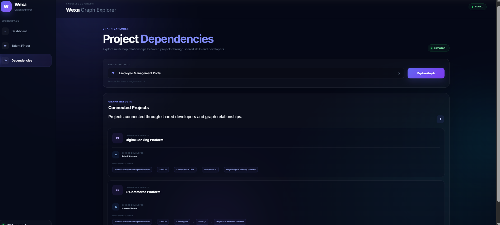
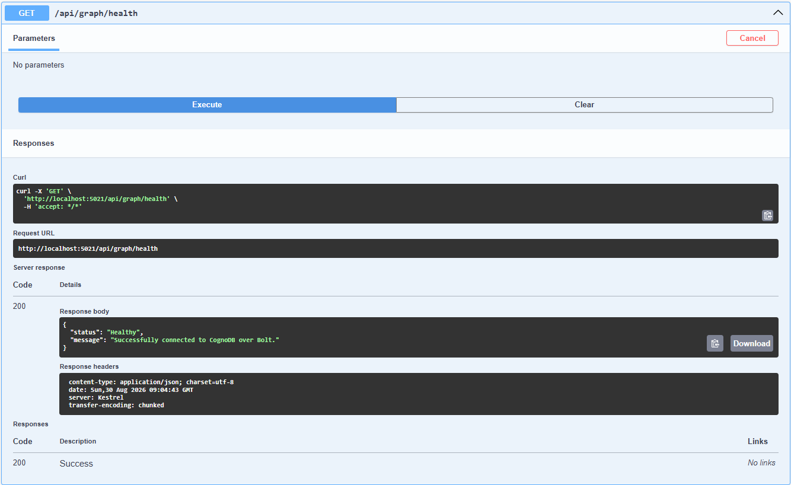
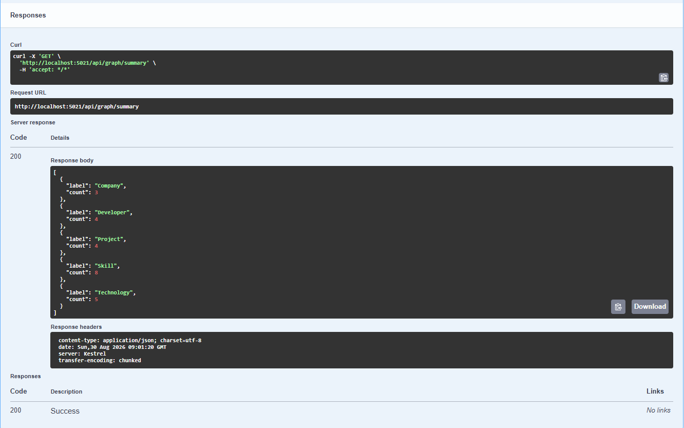
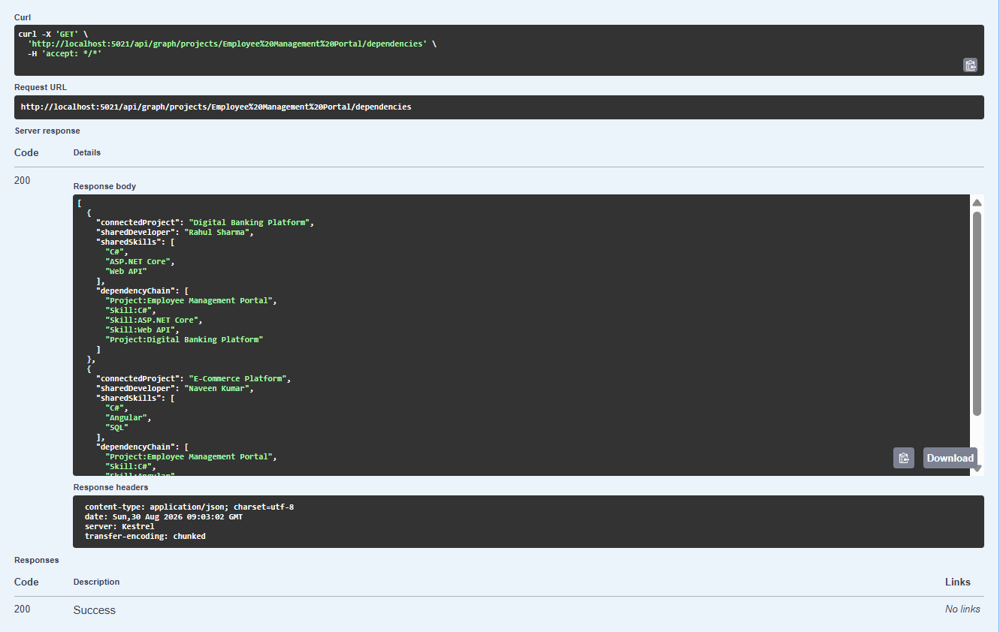
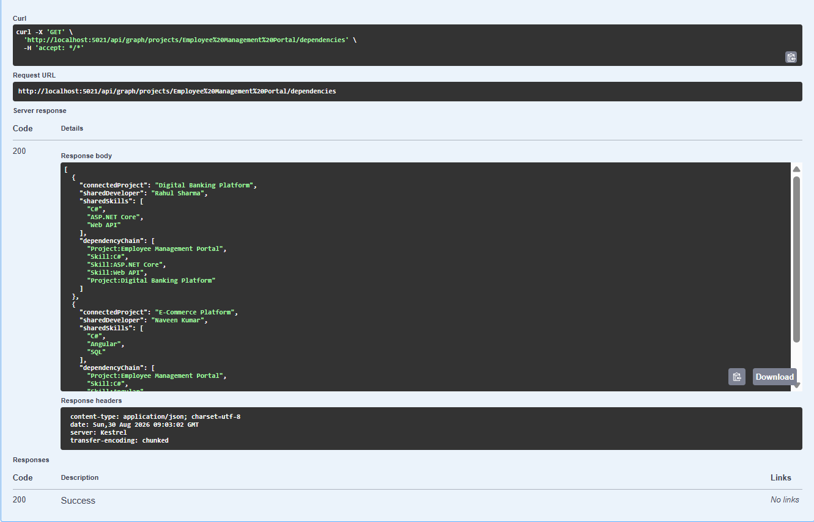

\# Wexa Graph Explorer


Wexa Graph Explorer is a web application built for the Wexa AI CognoDB take-home assignment. The application uses a graph database to represent developers, projects, skills, technologies, and companies, and provides a simple interface for exploring the relationships between them.


The application has two main features. The first is \*\*Talent Finder\*\*, which finds developers whose skills match the requirements of a selected project and excludes developers who have already worked on that project. The second is \*\*Project Dependencies\*\*, which finds relationships between projects through shared developers and skills.


The backend is implemented using ASP.NET Core 8 and the official Neo4j .NET Driver. The frontend is implemented using Angular 20. CognoDB is used as the graph database and communicates with the backend through the Bolt protocol.


\---


\## 1. Application Overview


The application represents an engineering organization as a graph.


A developer can have multiple skills, work for a company, and work on multiple projects. A project can require several skills and use different technologies.


For example, the following relationship exists in the application:


```text

Developer

&#x20;   |

&#x20;   | HAS\_SKILL

&#x20;   v

&#x20; Skill

```


A developer can also have a relationship with a project:


```text

Developer

&#x20;   |

&#x20;   | WORKED\_ON

&#x20;   v

&#x20;Project

```


Projects have their own relationships with skills and technologies:


```text

Project

&#x20;  |                    |

&#x20;  | USES\_SKILL        | USES\_TECHNOLOGY

&#x20;  v                    v

&#x20;Skill              Technology

```


This structure allows the application to answer questions by traversing the graph instead of treating each entity as an isolated record.


\---


\## 2. Why I Chose a Graph Database


The main reason for choosing a graph database is that the useful information in this application comes from the relationships between entities.


For example, Talent Finder needs to start with a project, find the skills required by that project, find developers who have those skills, check their project history, and exclude developers who have already worked on the selected project.


The relationship can be represented as:


```text

Project

&#x20;  |

&#x20;  | USES\_SKILL

&#x20;  v

&#x20;Skill

&#x20;  ^

&#x20;  | HAS\_SKILL

&#x20;  |

Developer

&#x20;  |

&#x20;  | WORKED\_ON

&#x20;  v

Project History

```


This type of traversal can certainly be implemented in a relational database, but it would require several tables and joins between project, skill, developer, and project-history tables.


The Project Dependencies feature is another example. It looks for projects that are connected through developers and shared skills. These relationships are naturally represented by nodes and edges in a graph.


For this use case, the graph model makes the relationships explicit and the Cypher queries easier to understand.


\---


\## 3. Technology Used


\### Backend


\* ASP.NET Core 8

\* C#

\* Official Neo4j .NET Driver

\* OpenCypher

\* Swagger / OpenAPI


\### Frontend


\* Angular 20

\* TypeScript

\* SCSS

\* Angular Router

\* Angular HTTP Client


\### Database


\* CognoDB Cloud

\* Bolt protocol

\* OpenCypher


\---


\## 4. Project Structure


The solution is divided into separate projects so that the database access, application logic, API, and frontend are kept separate.


```text

Assessment

│

├── scripts

│   ├── seed.cypher

│   └── queries.cypher

│

├── WexaGraphExplorer.Api

│   ├── Endpoints

│   │   └── GraphExplorerEndpoints.cs

│   ├── Properties

│   │   └── launchSettings.json

│   └── Program.cs

│

├── WexaGraphExplorer.Application

│   └── Graph

│       ├── GraphDtos.cs

│       ├── GraphExplorerService.cs

│       └── IGraphExplorerRepository.cs

│

├── WexaGraphExplorer.Domain

│

├── WexaGraphExplorer.Infrastructure

│   ├── CognoDb

│   │   ├── CognoDbConnectionTest.cs

│   │   └── CognoDbDriverFactory.cs

│   ├── Configuration

│   │   └── CognoDbSettings.cs

│   ├── Graph

│   │   └── CognoDbGraphExplorerRepository.cs

│   └── Seeding

│       └── CognoDbSeeder.cs

│

├── WexaGraphExplorer.Web

│

├── scripts

│   ├── seed.cypher

│   └── queries.cypher

│

└── WexaGraphExplorer.slnx

```


The API project is responsible for exposing the HTTP endpoints.


The Application project contains the graph-related application logic and DTOs.


The Infrastructure project contains the CognoDB connection, Neo4j driver configuration, repository implementation, and database seeding.


The Web project contains the Angular application.


The `scripts` directory contains the Cypher seed data and example queries used by the application.


\---


\## 5. Graph Data Model


The database contains five types of nodes.


\### Company


A company represents an organization where a developer has worked.


Properties:


```text

name

location

industry

```


\### Developer


A developer represents a person in the engineering organization.


Properties:


```text

name

email

experienceYears

location

```


\### Project


A project represents an engineering project.


Properties:


```text

name

description

```


\### Skill


A skill represents a technical skill that a developer can have or a project can require.


Properties:


```text

name

category

```


\### Technology


A technology represents a technology used by a project.


Properties:


```text

name

category

```


The relationships are:


```text

Developer ── HAS\_SKILL ──> Skill


Developer ── WORKED\_AT ──> Company


Developer ── WORKED\_ON ──> Project


Project ── USES\_SKILL ──> Skill


Project ── USES\_TECHNOLOGY ──> Technology

```


A simplified view of the complete graph is:


```text

&#x20;                   Company

&#x20;                      ^

&#x20;                      |

&#x20;                   WORKED\_AT

&#x20;                      |

&#x20;                      |

Developer ── HAS\_SKILL ──> Skill

&#x20;   |

&#x20;   |

&#x20;WORKED\_ON

&#x20;   |

&#x20;   v

&#x20;Project ── USES\_SKILL ──> Skill

&#x20;   |

&#x20;   |

&#x20;   └── USES\_TECHNOLOGY ──> Technology

```


\---


\## 6. Seed Data


The initial graph data is stored in:


```text

scripts/seed.cypher

```


The seed script first removes the existing graph:


```cypher

MATCH (n)

DETACH DELETE n;

```


It then creates the companies, technologies, skills, developers, and projects followed by their relationships.


The current seed data contains:


| Type                | Count |

| ------------------- | ----: |

| Companies           |     3 |

| Developers          |     4 |

| Projects            |     4 |

| Skills              |     8 |

| Technologies        |     5 |

| Total Nodes         |    24 |

| Total Relationships |    57 |


The seed script is executed automatically when the API starts successfully and the CognoDB environment variables are configured.


\---


\## 7. Main Queries


The application uses Cypher queries to retrieve information from CognoDB.


\### Graph Summary


The dashboard uses a query similar to:


```cypher

MATCH (n)

RETURN

&#x20;   labels(n)\[0] AS Label,

&#x20;   count(n) AS Count

ORDER BY Label;

```


This query counts the nodes belonging to each label.


It is used to display the number of projects, developers, skills, companies, and technologies on the dashboard.


\---


\### Talent Finder


Talent Finder starts with the selected project and finds the skills required by that project.


It then checks developers who have those skills.


The query also checks whether the developer has already worked on the selected project. Developers who have already worked on the project are excluded from the result.


The important part of the traversal is:


```text

Project

&#x20;  |

&#x20;  | USES\_SKILL

&#x20;  v

Skill

&#x20;  ^

&#x20;  | HAS\_SKILL

&#x20;  |

Developer

```


The project name is passed to the query as a parameter:


```text

$projectName

```


The application does not concatenate the project name into the Cypher query.


\---


\### Project Dependencies


The Dependencies page looks for projects that are connected through developers and shared skills.


For example:


```text

Employee Management Portal

&#x20;         |

&#x20;         | USES\_SKILL

&#x20;         v

&#x20;        C#

&#x20;         ^

&#x20;         | USES\_SKILL

&#x20;         |

Digital Banking Platform

```


A developer can also connect the two projects:


```text

Employee Management Portal

&#x20;         ^

&#x20;         |

&#x20;     WORKED\_ON

&#x20;         |

&#x20;     Developer

&#x20;         |

&#x20;     WORKED\_ON

&#x20;         |

&#x20;         v

Digital Banking Platform

```


This is a multi-hop relationship and is one of the main reasons a graph database is suitable for this application.


The dependency query also receives the project name as a parameter.


\---


\## 8. Parameterized Queries


User input is not directly inserted into Cypher strings.


For example, the repository creates a parameter:


```csharp

var parameters = new Dictionary<string, object>

{

&#x20;   \["projectName"] = projectName

};

```


The Cypher query then uses:


```cypher

$projectName

```


This keeps query structure separate from user input and follows the requirement to use parameterized queries.


\---


\## 9. CognoDB Setup


Before running the application, a CognoDB Cloud instance needs to be created.


Go to the CognoDB Cloud console and create an account.


Create a free C0 instance and select the required region.


After the instance is created, CognoDB provides a connection URI similar to:


```text

bolt+s://<instance-id>.databases.cognodb.cloud

```


The username for the provided instance is:


```text

cognodb

```


Save the generated password because it is required by the application.


\---


\## 10. Environment Variables


The application reads the CognoDB connection details from environment variables.


The following variables are required:


```text

COGNODB\_URI

COGNODB\_USERNAME

COGNODB\_PASSWORD

```


For example:


```text

COGNODB\_URI=bolt+s://<instance-id>.databases.cognodb.cloud

COGNODB\_USERNAME=cognodb

COGNODB\_PASSWORD=<your-password>

```


The actual password should not be added to the source code or committed to GitHub.


\---


\## 11. Running the Backend


Open PowerShell in the repository root.


First build the complete solution:


```powershell

dotnet build .\\WexaGraphExplorer.slnx

```


If the build succeeds, start the API:


```powershell

dotnet run --project .\\WexaGraphExplorer.Api

```


The API runs on:


```text

http://localhost:5021

```


When the application starts, it verifies the CognoDB connection and executes the seed script.


The console should show messages similar to:


```text

CognoDB connection successful

CognoDB seed completed. Executed 47 statements.

```


\---


\## 12. Swagger


Swagger is available at:


```text

http://localhost:5021/swagger

```


Swagger can be used to test the backend endpoints independently from the Angular application.


This is useful when debugging the API because it allows the graph endpoints to be tested directly.


\---


\## 13. Running the Angular Application


Open a second PowerShell window.


Move to the Angular project:


```powershell

cd .\\WexaGraphExplorer.Web

```


Install the required packages:


```powershell

npm install

```


Start the Angular development server:


```powershell

npm start

```


The frontend will be available at:


```text

http://localhost:4200

```


The Angular application uses the development proxy configuration in:


```text

WexaGraphExplorer.Web/proxy.conf.json

```


API requests beginning with `/api` are forwarded to the ASP.NET Core API running on port `5021`.


\---


\## 14. Using the Application


After starting both applications, open:


```text

http://localhost:4200/dashboard

```


The Dashboard displays the current graph statistics and CognoDB connection status.


From the navigation menu, open \*\*Talent Finder\*\*.


Enter or select a project such as:


```text

Employee Management Portal

```


The application returns developers who have matching skills and have not already worked on that project.


For example, the seeded data can return developers such as:


```text

Arjun Mehta

Priya Reddy

```


The application displays their company and matching skills.


Next, open \*\*Dependencies\*\*.


Select:


```text

Employee Management Portal

```


The application displays connected projects and the dependency paths between them.


For example:


```text

Project: Employee Management Portal

&#x20;       ↓

Skill: C#

&#x20;       ↓

Project: Digital Banking Platform

```


\---


\## 15. Error Handling


The application verifies the CognoDB connection when the API starts.


If the database is unavailable, the API reports the database initialization problem instead of silently assuming that the database is available.


The Angular application also handles API connection failures.


For example, if the API is stopped while Angular is running, the dashboard displays an error state indicating that the Graph API is unavailable and provides a retry option.


This makes the failure visible to the user rather than leaving the page in a loading state indefinitely.


\---


\## 16. Verifying the Database


The graph can be verified directly using Cypher.


To check the number of nodes:


```cypher

MATCH (n)

RETURN count(n) AS TotalNodes;

```


Expected result:


```text

24

```


To check relationships:


```cypher

MATCH ()-\[r]->()

RETURN count(r) AS TotalRelationships;

```


Expected result:


```text

57

```


To check the different node types:


```cypher

MATCH (n)

RETURN

&#x20;   labels(n)\[0] AS Label,

&#x20;   count(n) AS Count

ORDER BY Label;

```


Expected result:


```text

Company       3

Developer     4

Project       4

Skill         8

Technology    5

```


\---


## 17. Screenshots

Screenshots of the working application are included below.

### Dashboard



### Talent Finder



### Project Dependencies



### Swagger — Health



### Swagger — Summary



### Swagger — Dependencies



### Swagger — Dependencies Response


\---


\## 18. Running the Complete Application


The complete local setup requires two terminals.


\### Terminal 1 — API


From the repository root:


```powershell

dotnet run --project .\\WexaGraphExplorer.Api

```


The API should be available at:


```text

http://localhost:5021

```


\### Terminal 2 — Angular


From the repository root:


```powershell

cd .\\WexaGraphExplorer.Web

npm start

```


The Angular application should be available at:


```text

http://localhost:4200

```


Then open:


```text

http://localhost:4200/dashboard

```


The request flow is:


```text

Angular

&#x20;  |

&#x20;  | HTTP

&#x20;  v

ASP.NET Core API

&#x20;  |

&#x20;  | Neo4j .NET Driver / Bolt

&#x20;  v

CognoDB

```


\---


\## 19. Assignment Requirements


The implementation covers the main requirements of the assignment:


\* CognoDB graph database

\* Official Neo4j .NET Driver

\* Labeled graph nodes

\* Typed relationships

\* Node properties

\* Realistic seed data

\* Seed script included in the repository

\* Cypher queries included in the repository

\* Parameterized Cypher queries

\* Multi-hop graph traversal

\* Graph query that is relationship-oriented

\* Angular web application

\* ASP.NET Core Web API

\* Swagger / OpenAPI

\* Database connectivity handling

\* API error handling

\* Loading and error states in the UI


The remaining submission items are the GitHub repository, hosted application, screenshots, and screen recording.


\---


\## 20. Author


\*\*Naveen Kumar\*\*


Wexa AI — CognoDB Take-Home Assignment


